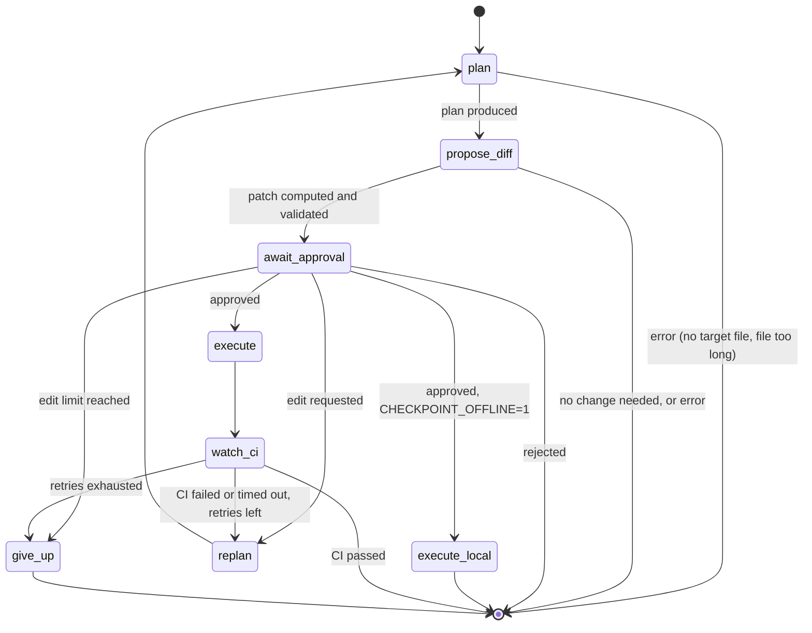

# Checkpoint — Architecture

This document covers the state machine, the WebSocket protocol, the GitHub integration, and the failure-recovery loop in detail. The README covers the pitch; this covers how it actually works.

## 1. Design goals

- **Pausable, resumable execution.** The agent must be able to stop mid-task, wait an arbitrary amount of time for a human, and resume with full context — not restart from scratch.
- **No silent side effects.** Any action that mutates real state (a Git commit, a push, a PR) happens strictly after an explicit approval event.
- **Inspectable by default.** Every node execution, prompt, and tool call is traced, not just logged.
- **Local reasoning.** The planning/diff-generation loop must run without a network call to a hosted LLM API.
- **An identity of its own.** The agent acts as a GitHub App, not as its author, so "the agent cannot write to `main`" is enforced by GitHub rather than by its own good behaviour (ADR-010).

## 2. LangGraph state machine



**Nodes**

| Node | Responsibility |
|---|---|
| `plan` | Resolves the target file (one file, ADR-003) and asks the local LLM for a `ChangePlan` with schema-constrained output |
| `propose_diff` | Local LLM returns the complete rewritten file as plain text; the patch is computed with difflib, checked for dropped definitions, and validated with `git apply --check` (ADR-001/007). One bounded retry. Two unchanged answers on a fresh task end the run as "no change proposed" (ADR-011) |
| `await_approval` | `interrupt()` — graph execution suspends here; state is checkpointed. The payload carries the diff, the plan, the stats, the retry reason and `opened_at` |
| `execute` | Applies the diff, creates or reuses the branch, commits with a `Checkpoint-Attempt: N` trailer, pushes, opens or reuses the PR |
| `execute_local` | The offline path (`CHECKPOINT_OFFLINE=1`): applies the approved patch to the workspace. No push, no PR |
| `watch_ci` | Polls GitHub Actions for the run triggered by our own `head_sha`, publishing progress; on failure it fetches the failing job's log |
| `replan` | Clears per-attempt state, increments `retry_count`, and puts the workspace back on the agent branch so the retry builds on the previous attempt |
| `give_up` | Retries exhausted: ends with an error naming the PR, rather than ending quietly and looking like success |

**State schema** (`app/state.py`, in full):

```python
class AgentState(TypedDict, total=False):
    task: str
    repo_path: str
    plan: dict[str, Any] | None          # ChangePlan.model_dump(); msgpack-safe

    diff: str
    new_content: str
    commit_message: str

    approval_status: Literal["pending", "approved", "rejected", "edit_requested"]
    edit_note: str

    branch: str
    pr_url: str | None
    head_sha: str
    ci_status: Literal["pending", "passed", "failed", "timeout"] | None
    ci_run_url: str | None
    ci_failure_log: str

    retry_count: Annotated[int, _keep_last]
    error: str
    no_change_reason: str                # the task was already done (ADR-011)
    human_pause_s: float | None          # measured at the last gate
    rewrite_attempt: int                 # which propose_diff attempt won (1 = first)
```

`new_task()` resets every task-scoped field. A thread outlives the task that created it, so anything left behind would make the next task look already-shipped.

**Checkpointing:** a SQLite-backed LangGraph checkpointer (`SqliteSaver`, `check_same_thread=False`) persists `AgentState` at every node boundary. This is what makes `await_approval` a real pause rather than a blocking call — the process can restart entirely and resume mid-approval from the saved checkpoint, keyed by `thread_id`.

**Resuming is not restarting (ADR-005).** `graph.invoke(input_dict, config)` on a paused thread re-enters at `START` and overwrites state. Only `Command(resume=payload)` continues inside `interrupt()`, and `None` re-runs a node that crashed. The CLI and the WebSocket layer both enforce that distinction structurally.

## 3. Realtime layer

FastAPI hosts the WebSocket endpoint, a small REST surface and the dashboard's static file. One WebSocket connection per session; message types are small and typed.

**Agent → dashboard**

| Type | Carries | Meaning |
|---|---|---|
| `session` | `thread_id` | Which thread this socket is attached to |
| `status` | `message` | Coarse progress ("refreshing workspace...", "planning...") |
| `node_enter` | `node` | A graph node started |
| `node_exit` | `node`, and `pr_url` + `branch` for `execute` | A node finished; the PR link appears before CI starts |
| `node_paused` | `node` | The gate is open and waiting for a human |
| `token_progress` | `attempt`, `max_attempts`, `tokens` | The rewrite is streaming (CPU inference takes 40–70s) |
| `diff_proposed` | `diff`, `plan`, `stats`, `commit_message`, `retry_count`, `retry_reason`, `opened_at` | The approval gate payload, straight from the checkpointed interrupt |
| `ci_status` | `status`, `run_url` | Live Actions status while `watch_ci` polls |
| `execution_result` | `approval_status`, `pr_url`, `ci_status`, `ci_run_url` | The run ended |
| `no_change` | `message`, `plan` | The task was already done; nothing was applied (ADR-011) |
| `error` | `message`, `resumable?`, `refused?` | `resumable`: a node crashed and its input is checkpointed, so Retry re-runs it. `refused`: the request was turned down (wrong moment) and nothing ran |

Every error string is redacted before it leaves the process: the agent's token is in the git remote URL, so it reaches argv and git's own stderr.

**Dashboard → agent**

```json
{"type": "start",    "task": "add input validation to sandbox/search.py"}
{"type": "approval", "decision": "approved"}
{"type": "approval", "decision": "edit_requested", "note": "also handle empty string input"}
{"type": "resume"}
```

`approval` resumes the gate with `graph.invoke(Command(resume=decision), config)`. `resume` re-runs a node that crashed, with `None`. `start` is refused while a run is in flight, while the gate is open, or on a thread parked mid-node.

**REST**

| Endpoint | Purpose |
|---|---|
| `GET /health` | Liveness, plus the configured model |
| `GET /threads` | Recent threads with their task text |
| `GET /threads/{id}` | Rehydrate a session from the checkpointer: `next`, `awaiting_approval`, the interrupt payload, and the interesting state values |
| `GET /files` | The files the agent may edit (the planner's own filter), the read-only directories, and the workspace's branch |
| `POST /workspace/refresh` | Pull `origin/main` after a human merge. **409** while a run is in flight, since it hard-resets the workspace the graph is using |

**Threads and the event bus.** The graph runs in a worker thread, because `graph.invoke` blocks for the length of CPU inference. Events are handed to the event loop with `loop.call_soon_threadsafe`: `asyncio.Queue.put_nowait` from another thread enqueues the item but never wakes the loop, which batched every "live" update until the run finished. The bus is in-process and single-user by design; a second reader of the same thread sees the same events, but multi-user would need a real broker.

## 4. GitHub integration (ADR-010)

- **Identity: a GitHub App**, installed on the sandbox repository only. The agent exchanges the App's private key for an installation token, requesting exactly Contents RW, Pull requests RW, Actions R and Metadata R, so a permission added to the App later by mistake never reaches a token. Tokens last an hour and are reused until ten minutes before expiry.
- **Attribution:** commits and PRs are authored by `<app-slug>[bot]`, not by a person.
- **Branch strategy:** every task creates `checkpoint/<task-slug>-<sha1(task + thread_id)[:7]>`. The hash is seeded with the `thread_id`, not the clock, so one approval can never mint a second branch (ADR-008). The agent never writes to `main`.
- **Branch protection on `main` is a hard requirement, not optional hardening.** It is set with `enforce_admins=false`, so the repository admin (you) can still push directly, while the App — not an admin — cannot. `scripts/prove-agent-cannot-push-main.sh` demonstrates this against a throwaway protected branch.
- **Merging is always human.** The agent opens the PR; a follow-up task only sees the change after you merge it and the dashboard pulls `main`.
- **The PAT is a fallback only.** A fine-grained PAT still works, but it acts as the person who created it and inherits that person's admin bypass. The startup log and `scripts/doctor.sh` say which identity is in use.
- After PR creation, `watch_ci` polls `GET /repos/{owner}/{repo}/actions/runs?head_sha=...` until the run reaches a terminal state. Sandbox CI runs only on `checkpoint/**` branches, so a human's own pushes don't start it.

## 5. Self-healing loop

If `watch_ci` observes a failed run, it doesn't retry blindly. It pulls the failing job's log via the Actions API, feeds that output back into `plan` as additional context, and re-enters the graph — which means the next proposed diff goes through the **same** approval gate before anything is pushed again.

- A retry commits **on top of the previous attempt**, on the same branch and the same PR, with a `Checkpoint-Attempt: N` trailer in the commit message. Idempotence is keyed on (thread, attempt): the remote branch tip's trailer says which attempts are already pushed (ADR-009). The PR then tells the whole story — first attempt, CI failure, human approval, fix.
- `MAX_RETRIES=2` means **up to three gates** (the original plus two retries). Edit requests share that counter with CI failures.
- When the retries run out, `give_up` ends the run with an error that names the still-open PR. Ending quietly would make a red PR read as shipped.

## 6. Observability

LangSmith wraps the run via `LANGSMITH_TRACING` / `LANGSMITH_API_KEY` / `LANGSMITH_PROJECT` (the old `LANGCHAIN_TRACING_V2` name is not used). `CHECKPOINT_OFFLINE=1` turns tracing off, so the no-cloud claim is testable.

- **A task start and each resume are separate traces.** `interrupt()` ends the run, and a resume is a new invocation. LangSmith groups them in its **Threads** view, because every run carries the `thread_id` in its metadata.
- **The human pause is measured, not inferred.** `await_approval`'s span lasts milliseconds, so the waiting time is not a span at all. The gate's checkpointed payload records `opened_at`; whoever resumes the gate computes `human_pause_s` from it, stores it in state, and attaches it to the resumed trace as metadata, where it can be filtered and charted. Because `opened_at` lives in the checkpoint, the measurement survives a server restart mid-decision.
- **`rewrite_attempt`** records which `propose_diff` attempt produced the diff (1 = first try), which is the patch-validity metric in `METRICS.md`.
- Each node is its own span, so one trace shows the planning prompt and completion, the rewrite, the validation, and the GitHub calls.

## 7. Security notes

- **Local model:** the code being modified never leaves the machine during reasoning.
- **The agent never executes generated code locally.** CI runs it in GitHub's sandbox. That is a real security boundary, and it is the reason the loop is graded by CI rather than by a local test run.
- **The agent cannot edit its own specification.** `tests`, `test`, `demo` and `.github` are in `_SKIP_DIRS`, so the planner will not target them. The cheapest way to make a red build green is to delete the failing test, and a loop that can edit its own tests will eventually find that. The App also has no Workflows permission, so it cannot change CI.
- **Credentials:** the App's private key lives outside the repository (`*.pem` is gitignored), and installation tokens are short-lived. Every token the process mints is registered and redacted from every error string, because errors are checkpointed to SQLite and traced to LangSmith.
- **The dashboard has no auth** in this build (single-user, localhost) — a deliberate scope cut, not an oversight.

## 8. Decision record (ADRs)

| ADR | Decision |
|---|---|
| 001 | The model never writes a unified diff; it returns the whole file, Python diffs it and validates with `git apply --check` |
| 002 | `qwen2.5-coder:3b` by default: measured 19 tok/s versus 9.1 for 7B, below the 12 tok/s bar. 7B stays available via `OLLAMA_MODEL` |
| 003 | One file per task, ≤200 lines (`MAX_FILE_LINES`); `num_ctx=16384`, with separate generation budgets `OLLAMA_NUM_PREDICT=1536` (plan) and `OLLAMA_NUM_PREDICT_REWRITE=6144` (rewrite) |
| 004 | "No cloud inference", not "no internet": LangSmith and GitHub need the network. `CHECKPOINT_OFFLINE=1` makes the claim testable |
| 005 | Resuming is `Command(resume=…)` or `None`, never an input dict; `run` / `resume` / `status` are separate commands |
| 006 | Diff context must match the working tree byte for byte; only the model's output is normalised, and the `\ No newline at end of file` marker is added |
| 007 | The rewritten file is plain text, not a JSON string; the commit message is derived from the plan in Python |
| 008 | Nodes with external side effects are idempotent: the branch name is derived from the `thread_id`, and both the push and the PR check for prior work |
| 009 | Idempotence is keyed on (thread, attempt), not on branch existence. Keying on the branch made every CI retry a silent no-op |
| 010 | The agent is its own GitHub App identity, not a PAT: admins bypass `main` protection, the App cannot |
| 011 | A task that is already done ends as "no change proposed", not an error, and no prompt demands a change. Pressure to differ is how a model invents a cosmetic edit that reaches the gate looking real |

## 9. Deliberate scope cuts

Dashboard auth (single-user localhost) · multi-file diffs (ADR-003) · a React dashboard and Slack approvals · vector DB / RAG · local execution of generated code · multi-user threads and a shared event broker · stacked follow-up tasks that skip the human merge.
