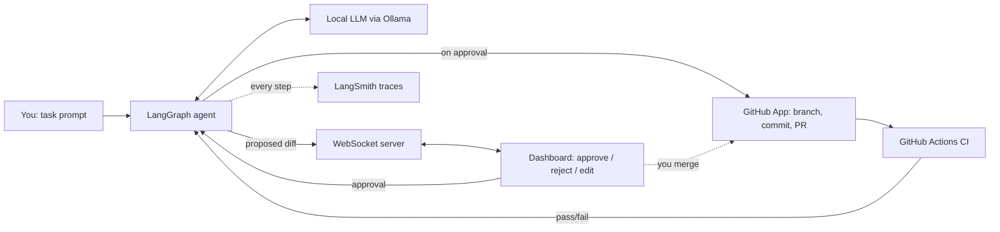

# Checkpoint

[](https://github.com/akhileshravikumar/checkpoint-code-agent/actions/workflows/ci.yml)

**A local-first, human-in-the-loop coding agent that only ships changes you approve.**


Checkpoint plans a code change, shows you the diff, and waits. Nothing touches your repository — no commit, no push, no PR — until you click Approve. Every decision, tool call, and token is traced in LangSmith, and the entire reasoning loop runs on a small model on your own machine: no API key, no cloud inference, your code never leaves your machine during reasoning.

Built to answer a simple question: what does it take to let an agent act on real infrastructure *safely*?

---

## Why

Most agent demos either run fully autonomously (impressive, unnerving) or don't touch anything real at all (safe, unconvincing). Checkpoint sits in between: it performs a real action — a real Git branch, a real commit, a real pull request on GitHub — but only past a human checkpoint. That approval gate, and the durable state that makes "pause here and resume later" possible, is the actual engineering problem this project is about.

## What it does

1. You give Checkpoint a task — e.g. *"add input validation to `sandbox/search.py`"*.
2. A local LLM (via Ollama) plans the change and rewrites the target file; Python computes the patch and proves it applies before you see it.
3. The agent **pauses**. The proposed diff streams over a WebSocket to a live dashboard.
4. You approve, reject, or request an edit — and the wait itself is measured.
5. On approval, Checkpoint pushes a branch and opens a real PR on GitHub, as its own GitHub App identity.
6. It watches the resulting GitHub Actions run. If CI fails, it re-plans from the failing job's log and comes back to the **same** gate; the fix lands as a second commit on the same PR.
7. **You merge.** The agent never does. The next task plans against `main` once you pull it.

Every step of this — every LLM call, every tool invocation, every pause and resume — is captured in LangSmith, so the full reasoning path is inspectable after the fact, not just the final diff.

## Features

- **Human-in-the-loop by design** — LangGraph's `interrupt`/`resume` pauses execution mid-graph and picks up exactly where it left off, backed by a durable checkpointer (not an in-memory hack). Kill the server at the gate, restart it, and the approval is still there.
- **The agent has its own identity** — it pushes as a GitHub App installed on one repository, with four permissions. Branch protection lets *you* push to `main` and refuses the App, so "the agent has never been able to write to `main`" is enforced by GitHub, not by trust. There's a script that proves it.
- **Real, low-stakes actions** — actual branches, commits and PRs on a repo you control; merging is always a human action.
- **Fully local inference** — a quantized 3B model through Ollama, on CPU.
- **CI-aware self-healing** — it polls the Actions run triggered by its own PR, re-plans from the failure log, and is re-gated on every attempt.
- **Live observability** — state timeline, token progress and CI status stream to the dashboard; every run is traced in LangSmith, including how long the human took to decide.

## Architecture at a glance



Full breakdown, state schema, message protocol and decision record: see [`ARCHITECTURE.md`](./ARCHITECTURE.md).

## Tech stack

| Layer | Choice | Why |
|---|---|---|
| Orchestration | LangGraph 1.2 | Native interrupt/resume + SQLite checkpointer for durable, pausable state |
| Local inference | Ollama · `qwen2.5-coder:3b` (Q4_K_M) | **19 tok/s measured** on CPU. `qwen2.5-coder:7b` is available as quality mode via `OLLAMA_MODEL`, but measured 9.1 tok/s here — too slow to iterate on |
| Observability | LangSmith | Every node, prompt and latency, plus the measured human pause per decision |
| Realtime transport | FastAPI + native WebSockets | Bidirectional: agent pushes state, dashboard pushes approvals |
| Dashboard | Plain HTML/JS | Enough surface to demo the loop without extra build tooling |
| Real-world action | GitHub App (PyGithub + REST) | Its own identity: branch, commit, PR and Actions polling, scoped to one repo |

No vector database in this build — the task doesn't need retrieval, and it's deliberately not another RAG project.

## Quickstart

Developed on WSL2 (Ubuntu) with the repo on the Linux filesystem — `git apply` and CRLF don't mix well across `/mnt/c`.

```bash
# 1. Pull a local model
ollama pull qwen2.5-coder:3b

# 2. Install (Python 3.12)
uv venv --python 3.12 && source .venv/bin/activate
uv pip install -r requirements-dev.txt

# 3. Configure
cp .env.example .env
#   GITHUB_APP_ID + GITHUB_APP_PRIVATE_KEY_PATH  -> docs/github-app-setup.md (~20 min)
#   GITHUB_OWNER / GITHUB_REPO                   -> your sandbox repository
#   LANGSMITH_API_KEY, LANGSMITH_PROJECT         -> optional; CHECKPOINT_OFFLINE=1 disables tracing

# 4. Check the environment before the first run
./scripts/doctor.sh

# 5. Run
uvicorn app.main:app --port 8000     # then open http://localhost:8000
```

There's also a terminal harness, if you'd rather not use the dashboard:

```bash
python -m app.cli run "add input validation to sandbox/search.py" --repo .workspace
python -m app.cli status <id>
python -m app.cli resume <id>
```

## The claims, as tests

The interesting tests are the ones that assert the project's thesis rather than its plumbing. All of them run offline, with no Ollama, no GitHub token and no `.env`:

| Test | Claim it proves |
|---|---|
| `test_graph_resume.py::test_pause_survives_a_process_restart_and_resumes` | The pause is durable: rebuild the graph from the SQLite file alone, resume, and the change lands |
| `test_graph_resume.py::test_rejection_applies_nothing` | Reject is a no-op |
| `test_self_heal.py::test_ci_failure_regates_and_the_fix_lands_on_the_same_pr` | A CI failure comes back to the gate, and the fix becomes a second commit on the same PR |
| `test_self_heal.py::test_rejecting_the_retry_pushes_nothing_more` | Every retry is gated too |
| `test_execute_node.py::test_running_twice_makes_one_branch_and_one_pr` | One approval can only produce one PR |
| `test_github_client.py::test_token_never_appears_in_an_error` | A token never reaches the checkpoint DB or LangSmith |
| `test_human_pause.py::test_the_pause_is_measured_from_the_checkpoint` | The human pause is measured, and survives a restart mid-decision |

```bash
pytest -q && ruff check app/ tests/
```

## Screenshots

<!-- W3D4: add the captures here


-->

## Project structure

```
checkpoint-code-agent/
├── app/
│   ├── graph.py          # LangGraph state machine, gate, re-plan, give-up
│   ├── nodes/            # plan, propose_diff, execute, watch_ci
│   ├── diffing.py        # difflib patch build + semantic and git validation
│   ├── github_client.py  # GitHub App auth, branch / commit / PR / Actions
│   ├── events.py         # in-process event bus (worker thread -> WebSocket)
│   ├── main.py           # FastAPI: WebSocket, REST, dashboard
│   └── cli.py            # terminal harness: run / resume / status
├── dashboard/
│   └── index.html        # live agent view + approve/reject UI
├── scripts/
│   ├── doctor.sh                        # environment preflight
│   ├── reset-sandbox.sh                 # put the sandbox back into the demo state
│   └── prove-agent-cannot-push-main.sh  # the agent's identity, refused by GitHub
├── tests/
├── ARCHITECTURE.md
└── README.md
```

## Roadmap

- [ ] Multi-file diffs in a single approval (see ADR-003 in [`ARCHITECTURE.md`](./ARCHITECTURE.md))
- [ ] Stacked follow-up tasks, without waiting for a merge
- [ ] Slack notification on approval request (approve from Slack too)
- [ ] Swap the dashboard for a small React app
- [ ] Support additional local models for side-by-side comparison in LangSmith

## What I'd do differently

- **Build the CLI harness before the dashboard.** I debugged the graph through a WebSocket for a day longer than I needed to.
- **Write the end-to-end test the day the loop is built.** Unit tests of `execute` in isolation passed while the self-healing loop as a whole could never heal: idempotence was keyed on the branch, so every CI retry silently pushed nothing.
- **Don't assume the observability you want exists.** I planned to show the human pause as a long span in LangSmith. It isn't one — the resume is a separate trace — so the pause is now measured from the checkpoint and attached as metadata.