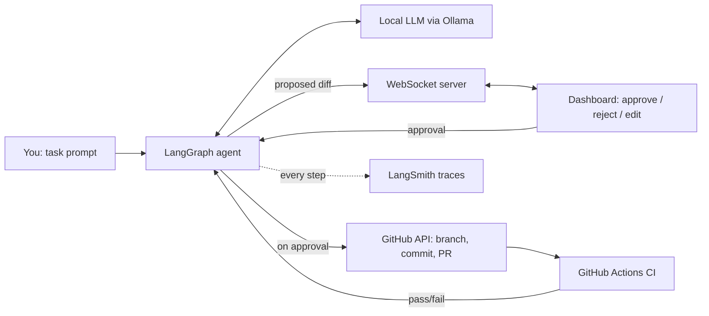

# Checkpoint

**A local-first, human-in-the-loop coding agent that only ships changes you approve.**

Checkpoint plans a code change, shows you the diff, and waits. Nothing touches your repository — no commit, no push, no PR — until you click Approve. Every decision, tool call, and token is traced in LangSmith, and the entire reasoning loop runs on a small model on your own machine, no API key, no cloud inference, no internet required once the model is pulled.

Built to answer a simple question: what does it take to let an agent act on real infrastructure *safely*?

---

## Why

Most agent demos either run fully autonomously (impressive, unnerving) or don't touch anything real at all (safe, unconvincing). Checkpoint sits in between: it performs a real action — a real Git branch, a real commit, a real pull request on GitHub — but only past a human checkpoint. That approval gate, and the durable state that makes "pause here and resume later" possible, is the actual engineering problem this project is about.

## What it does

1. You give Checkpoint a task — e.g. *"add input validation to `search.py`"*.
2. A local LLM (via Ollama) plans the change and drafts a diff.
3. The agent **pauses**. The proposed diff streams over a WebSocket to a live dashboard.
4. You approve, reject, or request an edit.
5. On approval, Checkpoint pushes a branch and opens a real PR on GitHub.
6. It watches the resulting GitHub Actions run. If CI fails, it loops back, proposes a fix, and asks for approval again.

Every step of this — every LLM call, every tool invocation, every pause and resume — is captured as a LangSmith trace, so the full reasoning path is inspectable after the fact, not just the final diff.

## Features

- **Human-in-the-loop by design** — LangGraph's `interrupt`/`resume` pauses execution mid-graph and picks up exactly where it left off, backed by a durable checkpointer (not an in-memory hack).
- **Real, low-stakes actions** — actual GitHub branches, commits, and PRs on a repo you control, gated by branch protection so nothing reaches `main` without a human merge.
- **Fully local inference** — runs on a quantized 3B model through Ollama; no data leaves your machine during reasoning.
- **CI-aware self-healing** — polls the GitHub Actions run triggered by its own PR and re-plans on failure, still gated by approval.
- **Live observability** — every agent step streams to a dashboard over a raw WebSocket; every run is traced end-to-end in LangSmith.

## Architecture at a glance



Full breakdown, state schema, and message protocol: see [`ARCHITECTURE.md`](./ARCHITECTURE.md).

## Tech stack

| Layer | Choice | Why |
|---|---|---|
| Orchestration | LangGraph | Native interrupt/resume + checkpointer for durable, pausable state |
| Local inference | Ollama (qwen2.5-coder:3b, Q4_K_M) | Runs on CPU, no API cost, no internet dependency at inference time |
| Observability | LangSmith | Full trace of every node, tool call, and latency |
| Realtime transport | FastAPI + native WebSockets | Bidirectional: agent pushes state, dashboard pushes approvals |
| Dashboard | Plain HTML/JS | Enough surface to demo the loop without extra build tooling |
| Real-world action | GitHub API (PyGithub / `gh` CLI) | Branch, commit, PR creation and CI status polling |

No vector database in this build — the task doesn't need retrieval, and it's deliberately not another RAG project.

## Quickstart

```bash
# 1. Pull a local model
ollama pull qwen2.5-coder:3b

# 2. Install deps
pip install -r requirements.txt

# 3. Configure
cp .env.example .env
# set GITHUB_TOKEN (fine-grained PAT, scoped to one repo)
# set LANGSMITH_API_KEY, LANGCHAIN_PROJECT

# 4. Run
uvicorn app.main:app --reload

# 5. Open the dashboard
open http://localhost:8000
```

## Project structure

```
checkpoint/
├── app/
│   ├── graph.py          # LangGraph state machine
│   ├── nodes/            # plan, propose_diff, execute, notify
│   ├── github_client.py  # branch / commit / PR / Actions polling
│   ├── ws_server.py      # WebSocket event bus
│   └── main.py           # FastAPI entrypoint
├── dashboard/
│   └── index.html        # live agent view + approve/reject UI
├── ARCHITECTURE.md
└── README.md
```

## Roadmap

- [ ] Multi-file diffs in a single approval
- [ ] Slack notification on approval request (approve from Slack too)
- [ ] Swap dashboard for a small React app with diff syntax highlighting
- [ ] Support additional local models for side-by-side comparison in LangSmith

## License

MIT
